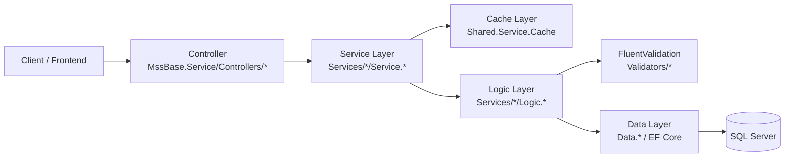
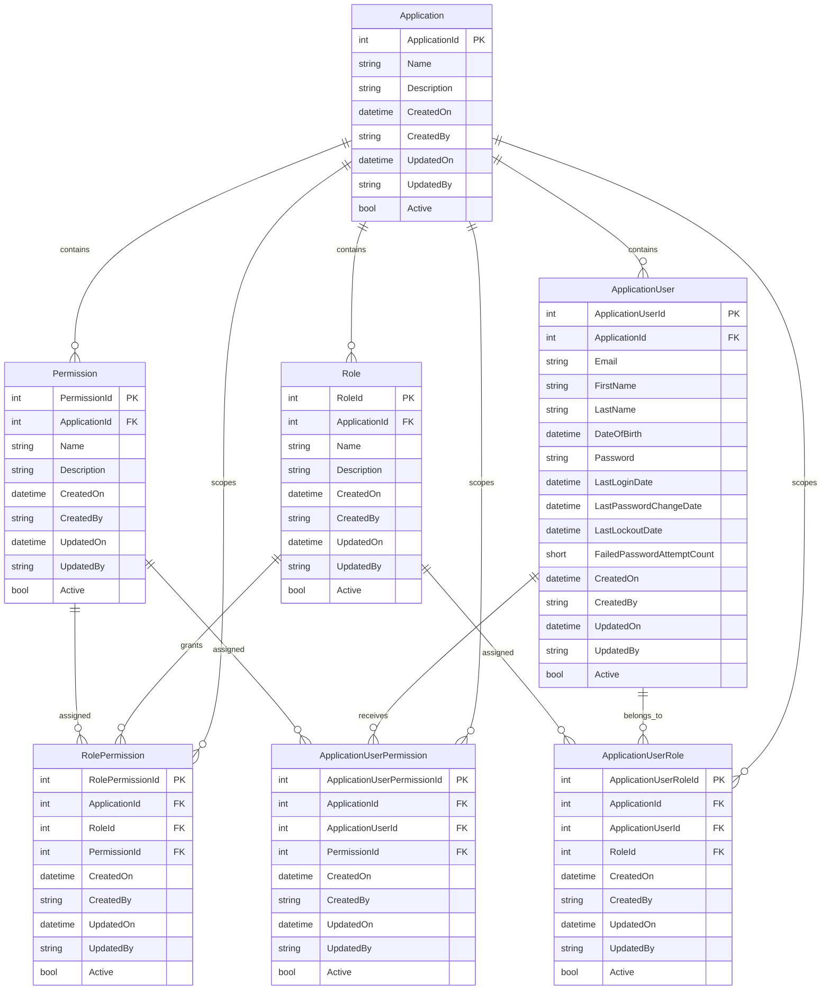

# MssBase.Service Architecture

This document explains how the main layers in the solution fit together and how the Security domain is modeled.

## Solution Shape

The solution uses a thin API host with supporting class library projects for contracts, DTOs, services, business logic, data access, and shared infrastructure.

- `MssBase.Service`: ASP.NET Core host, controllers, dependency injection, OpenAPI, JSON configuration, and request pipeline.
- `Services/Security/Contract.Security`: service and logic interfaces consumed by the API and other layers.
- `Services/Security/Dto.Security`: request and response DTOs shared across controller, service, and logic boundaries.
- `Services/Security/Service.Security`: application service layer responsible for orchestration, cache behavior, and delegating to logic.
- `Services/Security/Logic.Security`: business rules, validation, filtering, and EF Core query/update logic.
- `Services/Security/Data.Security`: EF Core `DbContext`, entity models, and table configuration.
- `Shared/*`: cross-cutting models, cache abstractions, validation helpers, base request/response types, and shared data utilities.
- `Services/Logger/Service.Logger`: logging service used by the API base controller.
- `Tests/*`: integration and unit tests around service, shared logic, and shared service behaviors.

## Request Flow

For Security endpoints, the runtime flow is intentionally straightforward:

1. A controller accepts HTTP input and converts route, query, or body data into DTOs.
2. The service layer builds cache keys, decides whether to read or invalidate cache, and delegates to logic.
3. The logic layer validates input, applies business rules, and executes EF Core queries or writes.
4. The data layer maps entity classes to SQL tables and relationships through `SecurityDBContext` and `IEntityTypeConfiguration` classes.
5. Results are converted back into DTOs and returned through the service and controller.

## Layer Responsibilities

### Controller

Controllers are the HTTP entry point.

- They define routes such as `api/security/[controller]`.
- They translate HTTP arguments into DTOs and base request objects.
- They do not contain database access or business rules.
- They wrap execution in `try/catch` and delegate error handling to `ApiBaseController`.

Example: `PermissionController` delegates `GetAll`, `GetById`, `Filter`, `Insert`, `Update`, and `Delete` to `IPermissionService`.

### Service

Services are the orchestration and cache boundary.

- They expose the operations used by controllers through interfaces in `Contract.Security`.
- They generate cache keys for read operations.
- They invalidate cache for write operations.
- They delegate business work to the corresponding logic class.

Example: `PermissionService` builds cache keys for `GetAll`, `GetById`, and `Filter`, then delegates to `IPermissionLogic`.

### Logic

Logic classes own business rules and EF Core query composition.

- They validate requests with FluentValidation.
- They enforce domain checks such as foreign key existence and uniqueness.
- They compose filters like `IncludeInactive`, audit filters, and entity-specific criteria.
- They create, update, and delete EF Core entities.

Example: `PermissionLogic` validates the request, confirms that `ApplicationId` exists, checks `Name` uniqueness, and queries `dbContext.Permissions`.

### Data

The data layer defines the persistence model and database mappings.

- `SecurityDBContext` exposes `DbSet<T>` properties for each Security entity.
- `Configuration/*Configuration.cs` files define keys, indexes, constraints, and relationships.
- Entity classes under `Models/` represent the database tables and navigation properties.

This layer is the source of truth for current table structure and relationships.

### DTO and Contract

These projects define the boundary models and interfaces used between layers.

- `Dto.Security` contains request models, filter models, and response DTOs.
- `Contract.Security` contains `I*Service` and `I*Logic` interfaces.
- This keeps the API, service, and logic layers decoupled from concrete implementations.

### Shared

Shared projects provide cross-cutting building blocks used across domains.

- `Shared.Models`: base models like error/validation responses and common request types.
- `Shared.Contracts`: shared abstractions such as cache and connection string interfaces.
- `Shared.Logic`: validation helpers and shared logic utilities.
- `Shared.Service`: shared services such as cache implementations and cache utility helpers.
- `Shared.Data`: common data helpers and audit field configuration used by EF mappings.

## Dependency Direction

Project references follow a consistent downward dependency direction:

- API host depends on contracts, DTOs, services, shared libraries, and logging.
- Service depends on contracts, DTOs, logic, and shared service abstractions.
- Logic depends on contracts, DTOs, data, shared logic, and shared models.
- Data depends on DTOs, contracts, shared data, and shared logic support.
- DTOs and contracts sit near the boundary and are reused by the upper layers.

In practice, business behavior should move downward from controller to service to logic, while persistence concerns stay in the data layer.

## Security Domain

The Security domain centers on these primary entities and join tables:

- `Application`: top-level container for users, roles, and permissions.
- `ApplicationUser`: user account belonging to an application.
- `Role`: role belonging to an application.
- `Permission`: permission belonging to an application.
- `RolePermission`: join table mapping roles to permissions within an application.
- `ApplicationUserPermission`: join table mapping users directly to permissions within an application.
- `ApplicationUserRole`: join table mapping users to roles within an application.

All of these entities inherit audit fields through the shared auditable base entity pattern.

## Security Database Schema

The diagram below reflects the EF Core model in `Services/Security/Data.Security`, which is the authoritative schema source in this repository. The helper SQL script under `Scripts/Sql/SecurityDBQueries.sql` covers most of the schema, but it does not currently include `ApplicationUserRole`.

## Relationship Notes

- `Application` is the parent of every other Security entity.
- `RolePermission` is the many-to-many bridge between `Role` and `Permission`.
- `ApplicationUserPermission` supports direct permission assignment to a user.
- `ApplicationUserRole` supports role assignment to a user.
- Join tables include `ApplicationId`, so assignments are explicitly scoped to an application instead of relying only on indirect joins.
- EF configuration adds unique indexes to the join tables to prevent duplicate assignments.

## Runtime Concerns

### Validation

- Validation is registered in DI per request model.
- Controllers use SharpGrip auto-validation.
- Logic performs additional domain validation that depends on database state.

### Caching

- Read methods in service classes build deterministic cache keys.
- Write methods clear cache entries by service section name before delegating to logic.
- Cache is backed by Redis when configured, with a dummy multiplexer fallback when Redis is unavailable.

### Logging

- API exceptions are logged through `ILoggerService` in `ApiBaseController`.
- Integration tests can swap in a test logger implementation through environment-specific registration.

## Tests

The repository includes both integration and unit tests:

- `Tests/ServiceTests/*`: integration-style tests for service behavior, including cache expectations.
- `Tests/SharedLogicTests/*`: unit tests for shared logic behavior.
- `Tests/SharedServiceTests/*`: unit tests for shared service behavior.

For new features, the expected pattern is to add validation and logic tests near the affected layer, plus integration tests for externally visible service behavior.